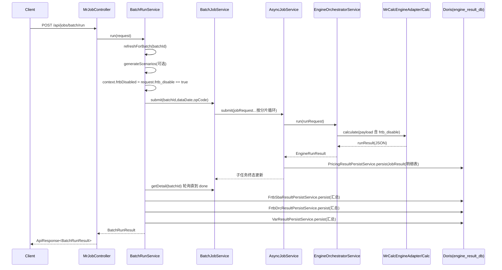

# Engine BatchRun 程序与接口调用链路文档

> 文档更新时间：2026-06-16 16:04:00 +08:00  
> 文档对应 Git 版本：`f31c64e`  
> 版本状态：本文档已按曲线生成发布 payload 和 engine 提交 `f31c64e` 刷新。

## 1. 文档目标与范围

本文档用于说明 `engine` 模块中 BatchRun 的端到端执行路径，覆盖：

- 对外接口链路：`/api/jobs/batch/submit`、`/api/jobs/batch/run`、`/api/jobs/batch/patch`、`/api/jobs/batch/{batchId}`
- 程序调用链：Controller -> Service -> Async 调度 -> Engine Adapter -> 结果落库
- 结果落地链路：**最终结果写入 Doris（engine_result_db）**
- 状态机、关键表、配置项、排障路径

不包含内容：

- 计量模型公式细节（如 FRTB/SACCR 算法公式）
- 前端页面调用流程

---

## 2. 对外接口清单（Batch）

统一返回结构为 `ApiResponse<T>`：

- `success`：是否成功
- `code`：状态码（成功为 `OK`）
- `message`：提示信息
- `data`：业务数据
- `timestamp`：返回时间戳

### 2.1 `POST /api/jobs/batch/submit`

用途：仅提交批次任务，不做汇总编排。

请求体 `BatchSubmitRequest`：

- `batchId`：批次号（可为空，默认会按 `yyyyMMdd_BATCH` 生成）
- `requestId`：请求号（可为空，默认同 `batchId`）
- `opCode`：`PRICING`/`SCENARIO`/`FRTB`
- `dataDate`：估值日（支持 `yyyy-MM-dd` 或 `yyyyMMdd`）
- `portfolio`：可选过滤
- `desk`：可选过滤

返回体 `BatchSubmitResult` 关键字段：

- `batchId`、`status`、`totalTrades`、`totalJobs`
- `detailUrl`（批次详情查询地址）

### 2.2 `POST /api/jobs/batch/run`

用途：执行总编排（提交 -> 等待子任务完成 -> 汇总 -> 汇总落库）。

请求体 `BatchRunRequest`：

- `batchId`
- `dataDate`
- `user`（可为空，默认 `outer_service`）
- `scenarioIdList`（有值则走 SCENARIO 模式）
- `persist_result` / `persistResult`（控制结果库写入）
- `frtb_disable`（默认 `false`；仅显式为 `true` 时关闭 MR_CALC 内 FRTB 敏感性与 DRC 明细计量）

返回体 `BatchRunResult`：

- `batchDetail`：批次执行明细状态
- `scenarioData`、`persistResult`、`runMode`、`scenarioGenerated`、`scenarioCount` 等受理与工作流信息
- FRTB SBA、DRC、VaR 汇总已拆为独立汇总接口，不再作为 `batch/run` 主链的必然输出

### 2.3 `POST /api/jobs/batch/patch`

用途：对已有批次按 `instrumentIdList` 局部重跑，增量追加子任务。

请求体 `BatchPatchRequest`：

- `batchId`
- `requestId`
- `dataDate`
- `instrumentIdList`（JSON 输入字段：`instrument_id_list`）
- `frtb_disable`（可选；补跑不从主批次继承该值，如需关闭 FRTB 明细计量必须显式传 `true`）

### 2.4 `GET /api/jobs/batch/{batchId}`

用途：查询批次状态与子任务清单。

返回体 `BatchDetailResult`：

- 批次聚合计数：`pendingJobs`、`runningJobs`、`successJobs`、`failedJobs`、`cancelledJobs`
- 子任务列表：`jobs[]`（含 `jobId`、`status`、`detailUrl`、`resultUrl`、`cancelUrl`）

---

## 3. BatchRun 总体程序链路

核心入口：

- Controller：`MrJobController.runBatch`
- 编排服务：`BatchRunService.run`

高层调用路径：

1. `MrJobController.runBatch` 接收请求，写审计日志上下文。
2. `BatchRunService.run` 校验参数，设置 `RequestContext`。
3. `calendarFileBootstrapService.refreshForBatch(batchId)` 刷新日历文件。
4. 若 `scenarioIdList` 非空：
   - `generateScenarios(...)` 生成并写入情景文件：
   - `<scenarioSetId>_<dataDate>_<batchId>.json`
   - `DECOMP_<scenarioSetId>_<dataDate>_<batchId>.json`
5. `submitBatch(...)` 调 `BatchJobService.submit(...)` 提交分片子任务。
6. `waitBatchFinished(batchId)` 轮询 `BatchJobService.getDetail` 直到批次终态。
7. 若批次成功：
   - `runFrtbSummary(...)` -> 汇总计算 + Doris 落库
   - `runDrcSummary(...)` -> 汇总计算 + Doris 落库
   - `runVarSummary(...)` -> 汇总计算 + Doris 落库
8. 返回 `BatchRunResult`。

---

## 4. `/batch/run` 时序图（含 Doris 写入）



---

## 5. `batch/submit` 详细调用链

入口方法：`BatchJobService.submitInternal`

### 5.1 数据准备

1. 校验 `opCode`、`dataDate`、`batchId`。
2. 从输入库读取：
   - `loadTradeRows(dataDate, portfolio, desk)`
   - `loadCurveRows(dataDate)`
3. 若交易或市场数据为空，直接抛错。

### 5.2 并发与重跑保护

1. `ensureBatchNotRunning(batchId)`：
   - 若该批次下仍有 `PENDING/RUNNING` 子任务，则拒绝覆盖提交。
2. `clearExistingBatchData(batchId)`：
   - 清理旧批次元数据（`MR_ASYNC_BATCH_JOB`、`MR_ASYNC_BATCH_ITEM`、`MR_ASYNC_JOB`）
   - 清理旧结果（Doris）：
   - `TB_OUT_TRADE_RESULT_DETAIL`
   - `TB_OUT_TRADE_SCENARIO_RESULT_DETAIL`
   - `TB_OUT_TRADE_FRTB_SENSITIVITY_DETAIL`
   - `TB_OUT_TRADE_DRC_DETAIL`
   - `TB_OUT_TRADE_DRC_RESULT`
   - `TB_OUT_MARKET_DATA_DETAIL`
   - `TB_OUT_PORTFOLIO_HIERARCHY`

### 5.3 分片与子任务创建

1. `TradeChunkSplitter.splitChunks(trades, weightBudget)` 得到分片。
2. 写入批次主表 `MR_ASYNC_BATCH_JOB`。
3. `syncPortfolioHierarchySnapshot(batchId, dataDate)` 快照层级到 Doris `TB_OUT_PORTFOLIO_HIERARCHY`。
4. 遍历每个 chunk：
   - `sliceCurvesWithTradeKeys(...)` 生成交易相关市场数据切片
   - `JobPayloadBuilder.buildPayload(...)` 组装 payload（含 `batch_meta`、`trade_dimension`、`scenario_ref`、`persist_result`、`frtb_disable`）
   - `frtb_disable=true` 时，`Calc -> FrtbCalcControl` 控制产品侧跳过 FRTB 敏感性与 DRC 明细生成
   - `AsyncJobService.submit(jobRequest)` 提交子任务
   - 写 `MR_ASYNC_BATCH_ITEM`
5. 更新批次状态为 `SUBMITTED`。

### 5.3.1 曲线生成发布 payload

`CURVE_GENERATION` 通过同步接口 `/api/engine/run` 调用。若需要将生成结果发布为有效市场数据，调用方必须在 `payload` 内显式传入 `persistGeneratedMarketData=true`：

```json
{
  "requestId": "curve-generation-001",
  "engineCode": "MR_CALC",
  "payload": {
    "oper_code": "CURVE_GENERATION",
    "persistGeneratedMarketData": true,
    "market_data": [],
    "curve_generation": []
  }
}
```

该开关仅用于曲线生成发布。普通批量估值 `JobPayloadBuilder.buildPayload(...)` 不设置该字段，避免估值任务隐式改写 `MR_MARKET_CURVE_INPUT`。

### 5.4 提交失败补偿

若中途异常：

1. 对已提交子任务逐个 `asyncJobService.cancel` 补偿取消。
2. 批次状态写为 `FAILED`，并记录告警。
3. 异常继续向上抛出。

---

## 6. `batch/patch`（局部重跑）链路

入口方法：`BatchJobService.submitPatch`

流程：

1. 校验 `batchId/dataDate/instrumentIdList`，并校验 `dataDate` 与批次一致。
2. `ensureBatchNotRunning`，避免与正在跑的批次冲突。
3. 按 `instrumentIdList` 读取交易与市场数据，重新分片。
4. `nextSeqNo(batchId)` 获取新子任务起始序号。
5. 按补跑请求中的 `frtb_disable` 组装 payload；缺省为 `false`，不从主批次继承。
6. 逐片提交到 `AsyncJobService.submit`，写入 `MR_ASYNC_BATCH_ITEM`。
7. `refreshBatchSummary` 刷新批次聚合状态。

---

## 7. Async 子任务状态机

核心服务：`AsyncJobService`

状态：

- `PENDING` -> `RUNNING` -> `SUCCESS` / `FAILED` / `CANCELLED`

关键机制：

1. 幂等提交：`idempotency_key` 命中直接返回已存在任务。
2. 分发器：
   - `dispatchPendingJobs` 抢占待执行任务（支持多实例）
   - `recoverStaleRunningJobs` 回收超时运行任务
3. 执行：
   - `executeJob` -> `runEngineWithRetry` -> `orchestratorService.run`
4. 终态附加动作 `handleTerminalSideEffects`：
   - 成功任务写 Doris 明细（关键动作）
   - 批次快照文件输出（非关键动作）

关键口径：

- 若“明细落库失败”，会触发 `markResultPersistFailed`，把任务从 `SUCCESS` 回写为 `FAILED`，错误码 `RESULT_PERSIST_FAILED`。

---

## 8. 最终结果写入 Doris 的完整链路

## 8.1 子任务级明细写入（执行后立即）

触发点：

- `AsyncJobService.handleTerminalSideEffects`
- 条件：`runResult.success == true` 且 `engineCode == MR_CALC`

写入服务：

- `PricingResultPersistService.persistJobResult`

写入表（Doris `engine_result_db`）：

- `TB_OUT_TRADE_RESULT_DETAIL`
- `TB_OUT_TRADE_SCENARIO_RESULT_DETAIL`
- `TB_OUT_TRADE_SCENARIO_VAR_RESULT_DETAIL`
- `TB_OUT_TRADE_FRTB_SENSITIVITY_DETAIL`
- `TB_OUT_TRADE_DRC_DETAIL`
- `TB_OUT_MARKET_DATA_DETAIL`

写入特征：

1. 先删后插（按 `JOB_ID`，并按 `BATCH_ID + INSTRUMENT_ID` 做覆盖清理）。
2. 严格表结构校验（缺列直接失败）。
3. 市场数据采取“外部输入优先”合并策略。
4. DRC 明细落库阶段要求 `JTD_CNY`，缺失会跳过并记录告警日志；DRC 汇总计算入口会再次校验 `SECURITY_TYPE / LEGAL_ENTITY / DRC_BUCKET / SENIORITY / TERM_TO_MATURITY / RISK_WEIGHT / JTD_CNY`，`sec non-CTP` 额外要求 `SECURITY_ID`。

## 8.2 批次级汇总写入（BatchRun 全部成功后）

触发点：

- `BatchRunService.run` 在 `waitBatchFinished` 成功后依次执行：
- `runFrtbSummary`
- `runDrcSummary`
- `runVarSummary`

写入服务与目标表：

1. FRTB SBA
   - 服务：`FrtbSbaResultPersistService.persist`
   - 表：`TB_OUT_FRTB_SBA_CLASS_RESULT`
2. DRC 汇总
   - 服务：`FrtbDrcResultPersistService.persist`
   - 表：`TB_OUT_TRADE_DRC_RESULT`
3. VaR 汇总
   - 服务：`VarResultPersistService.persist`
   - 表：`TB_OUT_VAR_RESULT`

写入特征：

- FRTB SBA 汇总写入 `TB_OUT_FRTB_SBA_CLASS_RESULT`，表结构由 `mr-app/src/main/resources/db/mr_output_schema_doris.sql` 提供。
- FRTB SBA 与 DRC 汇总均通过 Doris Stream Load 写入，DRC 结果表主键包含 `RULE_ID + GROUP_TYPE + GROUP_VALUE`。
- DRC `non-sec / sec non-CTP` standard 路径按监管 seniority 规则生成净 JTD；`sec non-CTP` 以 `SECURITY_ID` 区分证券化敞口，避免不同证券化敞口在同一 bucket 下直接轧差。

异常口径：

- 以上三类“汇总落库异常”均被 `BatchRunService` 捕获并 `warn`，**不阻断** `BatchRunResult` 返回。

## 8.3 非最终结果：批次快照文件

`BatchResultFileService.tryWriteSnapshotForJob` 会在批次全部子任务终态后写 JSON 快照到：

- `engine/data/batch-result/<batchId>_<timestamp>.json`

说明：

- 该文件用于审计与排障，不是最终计量结果主存储。
- 最终结果主存储口径仍为 Doris `engine_result_db`。

## 8.4 Doris 数据源配置

配置键（`application.properties`）：

- `engineresultdb.datasource.url`（默认 `jdbc:mysql://127.0.0.1:9030/engine_result_db...`）
- `engineresultdb.datasource.username`
- `engineresultdb.datasource.password`
- `engineresultdb.datasource.hikari.*`

---

## 9. 关键表与状态字段

输入/任务库（engine_db）：

- `MR_ASYNC_JOB`：子任务状态主表
- `MR_ASYNC_BATCH_JOB`：批次主表
- `MR_ASYNC_BATCH_ITEM`：批次子任务映射

结果库（engine_result_db / Doris）：

- 明细：`TB_OUT_TRADE_*`、`TB_OUT_MARKET_DATA_DETAIL`
- 汇总：`TB_OUT_TRADE_DRC_RESULT`、`TB_OUT_VAR_RESULT`、`TB_OUT_FRTB_SBA_CLASS_RESULT`

批次状态（`MR_ASYNC_BATCH_JOB.status`）：

- `PENDING`、`SUBMITTED`、`RUNNING`
- `SUCCESS`、`FAILED`、`PARTIAL_FAILED`、`CANCELLED`

子任务状态（`MR_ASYNC_JOB.status`）：

- `PENDING`、`RUNNING`、`SUCCESS`、`FAILED`、`CANCELLED`

---

## 10. 关键配置项

BatchRun 编排：

- `mr.batch.run.wait-poll-interval-ms`（轮询间隔）
- `mr.batch.run.wait-timeout-ms`（等待超时）
- `mr.calc.scenario-set.root-dir`（场景文件目录）

批次分片：

- `mr.batch.weight-budget`
- `mr.batch.weight-default`
- `mr.batch.product-weight-rules`
- `mr.batch.client.poll-after-ms`

异步执行：

- `mr.job.executor.core-size` / `max-size` / `queue-capacity`
- `mr.job.dispatcher.*`
- `mr.job.engine.retry.*`
- `mr.job.store.cleanup.*`

---

## 11. 排障与核对路径

### 11.1 批次是否结束

1. 查 `MR_ASYNC_BATCH_JOB` 状态。
2. 查 `MR_ASYNC_BATCH_ITEM` + `MR_ASYNC_JOB`，确认是否仍有 `PENDING/RUNNING`。

### 11.2 子任务成功但无结果

1. 查 `MR_ASYNC_JOB.error_code/error_message` 是否为 `RESULT_PERSIST_FAILED`。
2. 查看 `PricingResultPersistService` 日志与告警。
3. 校验 Doris 表结构是否与代码契约一致（列名、类型、必需列）。

### 11.3 汇总返回有值但 Doris 无数据

检查 `BatchRunService.runFrtbSummary/runDrcSummary/runVarSummary` 的 `warn` 日志：

- 汇总落库异常不会阻断接口返回，需单独看日志确认落库失败原因。

### 11.4 场景模式失败

1. 检查 `mr.calc.scenario-set.root-dir` 是否配置且可写。
2. 检查 `scenarioIdList_dataDate_batchId.json` 与 `DECOMP_...json` 是否生成。
3. 检查 `MrCalcEngineAdapter` 对 `scenario_ref` 的文件解析路径。

---

## 12. 主要类与方法索引

Controller：

- `com.zcyh.mr.springboot.api.MrJobController`

编排/批次：

- `com.zcyh.mr.springboot.service.BatchRunService#run`
- `com.zcyh.mr.springboot.service.BatchJobService#submitInternal`
- `com.zcyh.mr.springboot.service.BatchJobService#submitPatch`
- `com.zcyh.mr.springboot.service.BatchJobService#getDetail`

异步执行：

- `com.zcyh.mr.springboot.service.AsyncJobService#submit`
- `com.zcyh.mr.springboot.service.AsyncJobService#executeJob`
- `com.zcyh.mr.springboot.service.AsyncJobService#handleTerminalSideEffects`

引擎编排与适配：

- `com.zcyh.mr.springboot.service.EngineOrchestratorService#run`
- `com.zcyh.mr.springboot.engine.MrCalcEngineAdapter#calculate`

结果落库：

- `com.zcyh.mr.springboot.service.PricingResultPersistService#persistJobResult`
- `com.zcyh.mr.springboot.service.FrtbSbaResultPersistService#persist`
- `com.zcyh.mr.springboot.service.FrtbDrcResultPersistService#persist`
- `com.zcyh.mr.springboot.service.VarResultPersistService#persist`
- `com.zcyh.mr.springboot.service.BatchResultFileService#tryWriteSnapshotForJob`

---

## 13. 结论

在当前实现中，BatchRun 的结果写入 Doris 以子任务明细落库为主：

1. 子任务执行成功后立即写明细（交易/情景/敏感性/DRC/市场数据）；`frtb_disable=true` 时不生成 FRTB 敏感性与 DRC 明细内容，空字符串或空 JSON 对象按空值处理。
2. FRTB SBA、DRC、VaR 汇总通过独立汇总接口触发，不作为 `batch/run` 主链的必然步骤。

因此，核对 BatchRun 是否“真正完成”不能只看接口成功，必须同时核对：

- `MR_ASYNC_BATCH_JOB` 最终状态
- `MR_ASYNC_JOB` 末态与错误码
- Doris 目标表写入情况
