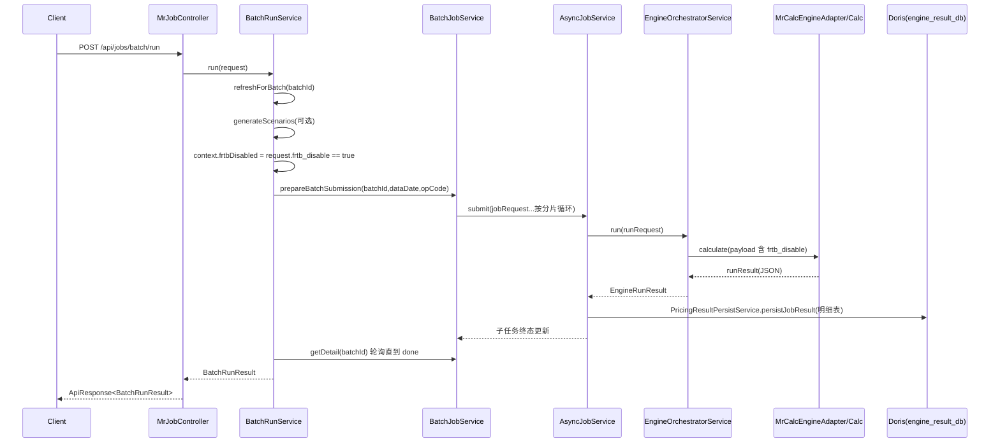

# Engine BatchRun 程序与接口调用链路文档

> 文档更新时间：2026-07-09 16:10:00 +08:00
> 文档对应 Git 版本：`b971d4e`
> 版本状态：本文档已按批量结果状态、情景结果日志、RRAO 拆分与 payload JSON 格式异常处理提交 `b971d4e` 刷新。

## 1. 文档目标与范围

本文档用于说明 `engine` 模块中 BatchRun 的端到端执行路径，覆盖：

- 对外接口链路：`/api/jobs/batch/run`、`/api/jobs/batch/patch`、`/api/jobs/batch/{batchId}`
- 程序调用链：Controller -> Service -> Async 调度 -> Engine Adapter -> 结果落库
- 结果落地链路：**最终结果写入 Doris（engine_result_db）**
- 状态机、关键表、配置项、排障路径

不包含内容：

- 计量模型公式细节（如 FRTB/SACCR 算法公式）
- 前端页面调用流程

---

## 2. 对外接口清单（Batch）

统一返回结构为 `ApiResponse<T>`：

- `success`：是否成功
- `code`：状态码（成功为 `OK`）
- `message`：提示信息
- `data`：业务数据
- `timestamp`：返回时间戳

### 2.1 `POST /api/jobs/batch/run`

用途：执行 MR_CALC 明细计量总编排（情景生成 -> 输入切片 -> 子任务计量 -> 明细落库）。

请求体 `BatchRunRequest`：

- `batchId`
- `dataDate`
- `user`（可为空，默认 `outer_service`）
- `regular_scenario_id_list`、`var_scenario_id_list`
- `normal_full_scenario_id_list`、`normal_reduced_scenario_id_list`
- `stress_reduced_scenario_id_list`、`nmrf_scenario_id_list`
- `persist_scenario`、`cache_scenario_result`
- `persist_result` / `persistResult`（控制结果库写入）
- `frtb_disable`（默认 `false`；仅显式为 `true` 时关闭 MR_CALC 内 FRTB 敏感性与 DRC 明细计量）
- `trade_filter`

返回体 `BatchRunResult`：

- `batchDetail`：批次执行明细状态
- `scenarioData`、`persistResult`、`runMode`、`scenarioGenerated`、`scenarioCount` 等受理与工作流信息
- `batch/run` 不接收汇总规则参数，也不执行 VaR、SBA、DRC、RRAO、IMA 汇总

### 2.2 `POST /api/jobs/batch/patch`

用途：对已有批次按 `instrumentIdList` 局部重跑，增量追加子任务。

请求体 `BatchPatchRequest`：

- `BatchRunRequest` 的全部外部运行参数
- `instrumentIdList`（JSON 输入字段：`instrument_id_list`）

局部重跑的固定边界：`batch_id` 必填；不允许 `persist_scenario=true`；不更新组合层级、市场数据快照和情景结果表。

### 2.3 `GET /api/jobs/batch/{batchId}`

用途：查询批次状态与子任务清单。

返回体 `BatchDetailResult`：

- 批次聚合计数：`pendingJobs`、`runningJobs`、`successJobs`、`failedJobs`、`cancelledJobs`
- 子任务列表：`jobs[]`（含 `jobId`、`status`、`detailUrl`、`cancelUrl`）

---

## 3. BatchRun 总体程序链路

核心入口：

- Controller：`MrJobController.runBatch`
- 编排服务：`BatchRunService.run`

高层调用路径：

1. `MrJobController.runBatch` 接收请求，写审计日志上下文。
2. `BatchRunService.run` 校验参数，设置 `RequestContext`。
3. 依次执行明细清理与日历准备。
4. 请求包含情景参数时生成并写出情景文件，MR_CALC 再从情景文件加载计量缓存。
5. 加载交易与市场数据，完成市场数据切片、交易分片和 payload 构建。
6. `BatchCalcSubmitTask.execute(...)` 按分片提交内部异步子任务。
7. `BatchCalcWaitTask` 轮询 `BatchJobService.getDetail` 直到批次终态。
8. 返回异步受理结果；工作流不执行任何汇总计算。

---

## 4. `/batch/run` 时序图（含 Doris 写入）



---

## 5. `batch/run` 内部子任务提交链路

入口任务：`BatchCalcSubmitTask.execute`

### 5.1 数据准备

1. `BatchTradeLoadTask` 从输入库读取交易。
2. `BatchMarketDataLoadTask` 从输入库读取市场数据。
3. `BatchChunkBuildTask` 按产品和权重预算生成交易分片。
4. `BatchPayloadBuildTask` 为每个分片生成 MR_CALC payload；交易或市场曲线 JSON 格式异常时，生成一条预失败子任务 payload 记录。

### 5.2 并发与重跑保护

1. `BatchRunService` 在启动工作流前保证同一批次不会重复运行。
2. `BatchJobService.initializeWorkflowBatch(...)` 初始化批次主记录并按本次执行口径清理历史数据：
   - 清理旧批次元数据（`MR_ASYNC_BATCH_JOB`、`MR_ASYNC_BATCH_ITEM`、`MR_ASYNC_JOB`）
   - 按 `batchId + dataDate` 清理 MR_CALC 明细结果（Doris）

### 5.3 分片与子任务创建

1. `BatchCalcSubmitTask` 写入批次总交易数、子任务数和分片权重。
2. 需要落库时，`syncPortfolioHierarchySnapshot(batchId, dataDate)` 快照层级到 Doris `TB_OUT_PORTFOLIO_HIERARCHY`。
3. 遍历 `BatchJobPayload`：
   - payload 构建阶段已失败的分片，不提交到 engine；系统写入一条 `MR_ASYNC_JOB.status=FAILED` 的预失败子任务，错误码为 `PAYLOAD_JSON_PARSE_ERROR`
   - `frtb_disable=true` 时，`Calc -> FrtbCalcControl` 控制产品侧跳过 FRTB 敏感性与 DRC 明细生成
   - `AsyncJobService.submit(jobRequest)` 提交子任务
   - 写 `MR_ASYNC_BATCH_ITEM`
4. 更新批次状态为 `SUBMITTED`，最终状态按子任务聚合为 `SUCCESS` / `PARTIAL_FAILED` / `FAILED`。

### 5.3.1 曲线生成发布 payload

`CURVE_GENERATION` 通过同步接口 `/api/engine/run` 调用。若需要将生成结果发布为有效市场数据，调用方必须在 `payload` 内显式传入 `persistGeneratedMarketData=true`：

```json
{
  "requestId": "curve-generation-001",
  "engineCode": "MR_CALC",
  "payload": {
    "oper_code": "CURVE_GENERATION",
    "persistGeneratedMarketData": true,
    "market_data": [],
    "curve_generation": []
  }
}
```

该开关仅用于曲线生成发布。普通批量估值 `JobPayloadBuilder.buildPayload(...)` 不设置该字段，避免估值任务隐式改写 `MR_MARKET_CURVE_INPUT`。

### 5.4 提交失败补偿

若中途异常：

1. payload JSON 格式异常按 chunk 记录为失败子任务，不阻断其他 chunk 提交。
2. 提交链路发生非 payload 格式类异常时，对已提交子任务逐个 `asyncJobService.cancel` 补偿取消。
3. 批次状态写为 `FAILED`，并记录告警。
4. 异常继续向上抛出。

---

## 6. `batch/patch`（局部重跑）链路

入口方法：`BatchRunService.patch`

流程：

1. 按正常运行请求校验全部外部参数，并额外校验 `batchId/dataDate/instrumentIdList`。
2. `ensureBatchNotRunning`，校验估值日与已有批次一致，并取得追加子任务序号。
3. 需要情景时重新生成并写出情景文件，MR_CALC 按正常流程从文件加载；固定 `persist_scenario=false`，不写 Doris 情景结果表。
4. 按 `instrumentIdList` 读取交易，正常加载市场数据并完成切片、分片和 payload 构建。
5. 进入 Calc 阶段后，仅按 `batchId + dataDate + instrumentId` 清理交易明细结果。
6. 追加 MR_CALC 子任务；不更新组合层级，不写市场数据快照，不输出批次结果快照文件。
7. 等待新增子任务结束并刷新批次状态。

---

## 7. Async 子任务状态机

核心服务：`AsyncJobService`

状态：

- `PENDING` -> `RUNNING` -> `SUCCESS` / `FAILED` / `CANCELLED`

关键机制：

1. 幂等提交：`idempotency_key` 命中直接返回已存在任务。
2. 分发器：
   - `dispatchPendingJobs` 抢占待执行任务（支持多实例）
   - `recoverStaleRunningJobs` 回收超时运行任务
3. 执行：
   - `executeJob` -> `runEngineWithRetry` -> `orchestratorService.run`
4. 终态附加动作 `handleTerminalSideEffects`：
   - 成功任务写 Doris 明细（关键动作）
   - 批次快照文件输出（非关键动作）

关键口径：

- 若“明细落库失败”，会触发 `markResultPersistFailed`，把任务从 `SUCCESS` 回写为 `FAILED`，错误码 `RESULT_PERSIST_FAILED`。

---

## 8. 最终结果写入 Doris 的完整链路

## 8.1 子任务级明细写入（执行后立即）

触发点：

- `AsyncJobService.handleTerminalSideEffects`
- 条件：`runResult.success == true` 且 `engineCode == MR_CALC`

写入服务：

- `PricingResultPersistService.persistJobResult`

写入表（Doris `engine_result_db`）：

- `TB_OUT_TRADE_RESULT_DETAIL`
- `TB_OUT_TRADE_SCENARIO_RESULT_DETAIL`
- `TB_OUT_TRADE_SCENARIO_VAR_RESULT_DETAIL`
- `TB_OUT_TRADE_FRTB_SENSITIVITY_DETAIL`
- `TB_OUT_TRADE_DRC_DETAIL`
- `TB_OUT_MARKET_DATA_DETAIL`（完整批次）

写入特征：

1. 先删后插（按 `JOB_ID`，并按 `BATCH_ID + INSTRUMENT_ID` 做覆盖清理）。
2. 严格表结构校验（缺列直接失败）。
3. 局部重跑跳过市场数据明细写入，只覆盖指定交易的计量明细。
4. DRC 明细落库阶段要求 `JTD_CNY`，缺失会跳过并记录告警日志；DRC 汇总计算入口会再次校验 `SECURITY_TYPE / LEGAL_ENTITY / DRC_BUCKET / SENIORITY / TERM_TO_MATURITY / RISK_WEIGHT / JTD_CNY`，`sec non-CTP` 额外要求 `SECURITY_ID`。

## 8.2 汇总边界

`BatchRunRequest`、`BatchRunWorkflowContext` 和批次任务列表均不包含汇总规则或汇总任务。VaR、SBA、DRC、RRAO、IMA 汇总通过独立接口按需执行，其结果不由 `batch/run` 清理、生成或导出。

## 8.3 Doris 数据源配置

配置键（`application.properties`）：

- `engineresultdb.datasource.url`（默认 `jdbc:mysql://127.0.0.1:9030/engine_result_db...`）
- `engineresultdb.datasource.username`
- `engineresultdb.datasource.password`
- `engineresultdb.datasource.hikari.*`

---

## 9. 关键表与状态字段

输入/任务库（engine_db）：

- `MR_ASYNC_JOB`：子任务状态主表
- `MR_ASYNC_BATCH_JOB`：批次主表
- `MR_ASYNC_BATCH_ITEM`：批次子任务映射

结果库（engine_result_db / Doris）：

- 明细：`TB_OUT_TRADE_*`、`TB_OUT_MARKET_DATA_DETAIL`
- 汇总结果表由独立汇总任务维护，不属于 BatchRun 工作流

批次状态（`MR_ASYNC_BATCH_JOB.status`）：

- `PENDING`、`SUBMITTED`、`RUNNING`
- `SUCCESS`、`FAILED`、`PARTIAL_FAILED`、`CANCELLED`

子任务状态（`MR_ASYNC_JOB.status`）：

- `PENDING`、`RUNNING`、`SUCCESS`、`FAILED`、`CANCELLED`
- payload JSON 格式异常会直接生成终态 `FAILED` 子任务，`error_code=PAYLOAD_JSON_PARSE_ERROR`，`error_message` 记录交易 `instrumentId` 或曲线 `marketDataType/curveId`

---

## 10. 关键配置项

BatchRun 编排：

- `mr.batch.run.wait-poll-interval-ms`（轮询间隔）
- `mr.batch.run.wait-timeout-ms`（等待超时）
- `mr.calc.scenario-set.root-dir`（场景文件目录）

批次分片：

- `mr.batch.weight-budget`
- `mr.batch.weight-default`
- `mr.batch.product-weight-rules`
- `mr.batch.client.poll-after-ms`

异步执行：

- `mr.job.executor.core-size` / `max-size` / `queue-capacity`
- `mr.job.dispatcher.*`
- `mr.job.engine.retry.*`
- `mr.job.store.cleanup.*`

---

## 11. 排障与核对路径

### 11.1 批次是否结束

1. 查 `MR_ASYNC_BATCH_JOB` 状态。
2. 查 `MR_ASYNC_BATCH_ITEM` + `MR_ASYNC_JOB`，确认是否仍有 `PENDING/RUNNING`。

### 11.2 子任务成功但无结果

1. 查 `MR_ASYNC_JOB.error_code/error_message` 是否为 `RESULT_PERSIST_FAILED`。
2. 查看 `PricingResultPersistService` 日志与告警。
3. 校验 Doris 表结构是否与代码契约一致（列名、类型、必需列）。

### 11.2.1 子任务未进入 engine

1. 查 `MR_ASYNC_JOB.error_code/error_message` 是否为 `PAYLOAD_JSON_PARSE_ERROR`。
2. 交易 JSON 格式异常时，`error_message` 会包含 `instrumentId`。
3. 市场曲线 JSON 格式异常时，`error_message` 会包含 `marketDataType` 与 `curveId`。
4. 该类失败只影响当前 chunk，其他 chunk 继续提交；批次可最终进入 `PARTIAL_FAILED`。

### 11.3 汇总结果核对

BatchRun 不执行汇总。汇总结果需按对应独立汇总接口和服务日志单独核对。

### 11.4 场景模式失败

1. 检查 `mr.calc.scenario-set.root-dir` 是否配置且可写。
2. 检查 `scenarioIdList_dataDate_batchId.json` 与 `DECOMP_...json` 是否生成。
3. 检查 `MrCalcEngineAdapter` 对 `scenario_ref` 的文件解析路径。

---

## 12. 主要类与方法索引

Controller：

- `com.zcyh.mr.springboot.api.MrJobController`

编排/批次：

- `com.zcyh.mr.springboot.service.BatchRunService#run`
- `com.zcyh.mr.springboot.service.BatchRunService#patch`
- `com.zcyh.mr.springboot.service.BatchJobService#getDetail`

异步执行：

- `com.zcyh.mr.springboot.service.AsyncJobService#submit`
- `com.zcyh.mr.springboot.service.AsyncJobService#executeJob`
- `com.zcyh.mr.springboot.service.AsyncJobService#handleTerminalSideEffects`

引擎编排与适配：

- `com.zcyh.mr.springboot.service.EngineOrchestratorService#run`
- `com.zcyh.mr.springboot.engine.MrCalcEngineAdapter#calculate`

结果落库：

- `com.zcyh.mr.springboot.service.PricingResultPersistService#persistJobResult`

---

## 13. 结论

在当前实现中，BatchRun 的结果写入 Doris 以子任务明细落库为主：

1. 子任务执行成功后立即写交易、情景损益、敏感性和 DRC 明细；完整批次同时维护市场数据、组合层级和情景生成明细。
2. 局部重跑只覆盖指定交易明细，不更新市场数据、组合层级和 Doris 情景生成结果；情景文件仍按正常流程生成。
3. BatchRun 不接收汇总规则，不执行或导出任何汇总结果。

因此，核对 BatchRun 是否“真正完成”不能只看接口成功，必须同时核对：

- `MR_ASYNC_BATCH_JOB` 最终状态
- `MR_ASYNC_JOB` 末态与错误码
- Doris 目标表写入情况
