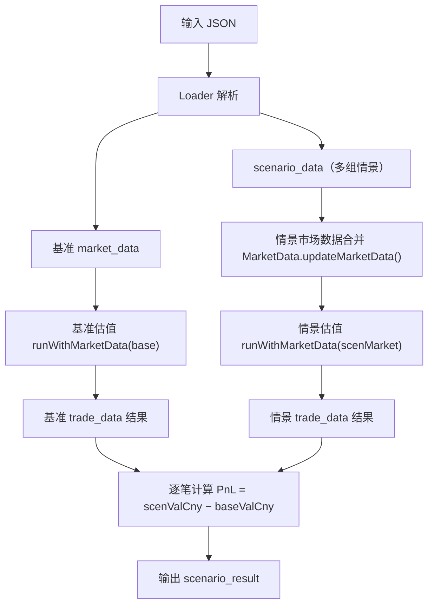

# 压力测试（Stress Testing）功能说明

## 一、概述

系统支持通过输入 JSON 中的 `scenario_data` 字段定义多组压力情景。每个情景包含一套增量市场数据，系统会在基准估值基础上，用情景市场数据替换/叠加后重新估值，计算各交易的损益变动（PnL）。

---

## 二、输入格式

```json
{
  "oper_code": "PRICING",
  "data_date": "20240329",
  "trade_data": [...],
  "market_data": [...],
  "scenario_data": [
    {
      "SCENARIO_NAME": "利率上行100bp",
      "market_data": [
        {
          "CURVE_TYPE": "IR_SPOT",
          "CURVE_ID": "CNY_3M",
          "CURVE_DATA": [
            {"TERM": 30, "RATE": 0.035},
            {"TERM": 90, "RATE": 0.038}
          ]
        }
      ]
    },
    {
      "SCENARIO_NAME": "利率下行50bp",
      "market_data": [...]
    }
  ]
}
```

### 字段说明

| 字段 | 类型 | 说明 |
|------|------|------|
| `SCENARIO_NAME` | String | 情景名称 |
| `market_data` | Array | 该情景下的增量市场数据，格式与顶层 `market_data` 一致 |

---

## 三、处理流程



### 关键步骤

1. **基准估值**：使用顶层 `market_data` 对所有交易估值
2. **市场数据合并**：调用 `MarketData.updateMarketData(base, scenMd)` 将情景数据叠加到基准上（同 CURVE_ID 的曲线整条替换）
3. **情景估值**：使用合并后的市场数据重新估值
4. **PnL 计算**：逐笔比对基准和情景的 `VALUATION_CNY`

---

## 四、输出格式

```json
{
  "data": {
    "trade_data": [...],
    "scenario_result": [
      {
        "SCENARIO_NAME": "利率上行100bp",
        "trade_data": [
          {
            "INSTRUMENT_ID": "TRADE_001",
            "BASE_VALUATION_CNY": -6048404.06,
            "SCENARIO_VALUATION_CNY": -6018276.06,
            "PNL": 30127.99
          }
        ]
      },
      {
        "SCENARIO_NAME": "利率下行50bp",
        "trade_data": [...]
      }
    ]
  }
}
```

### 字段说明

| 字段 | 说明 |
|------|------|
| `SCENARIO_NAME` | 情景名称 |
| `INSTRUMENT_ID` | 交易编号 |
| `BASE_VALUATION_CNY` | 基准估值（人民币） |
| `SCENARIO_VALUATION_CNY` | 情景估值（人民币） |
| `PNL` | 损益差异 = 情景估值 − 基准估值 |

---

## 五、数据校验

情景市场数据与顶层市场数据使用**完全相同**的校验逻辑：
- CURVE_TYPE / CURVE_DATA / CURVE_ID 非空检查
- 点位级别的类型校验和自动剔除
- 所有校验错误统一汇总到 `log_data`

---

## 六、涉及代码

| 文件 | 职责 |
|------|------|
| `Loader.java` | 解析 `scenario_data`，调用 `parseMarketData` 校验 |
| `Loader.ScenarioEntry` | 情景数据结构（scenarioName + MarketData） |
| `Calc.run()` | 遍历情景，调用估值，生成 `scenario_result` |
| `Calc.runWithMarketData()` | 通用估值方法，接受任意 MarketData |
| `MarketData.updateMarketData()` | 市场数据合并（基准 + 情景增量） |

---

## 七、注意事项

- `scenario_data` 为可选字段，不传则只做基准估值
- 每个情景独立估值，互不影响
- 情景市场数据是增量替换，未涉及的曲线保持基准值
- PnL 正值表示压力情景下盈利增加，负值表示亏损增加
