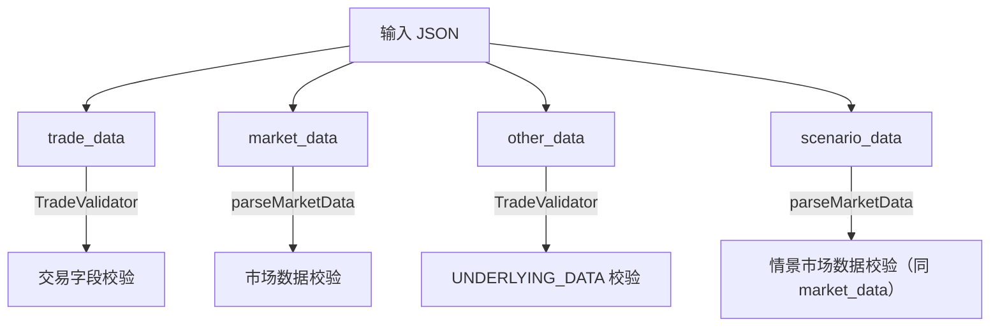

# 数据校验功能说明

## 一、概述

系统在交易解析和产品计算阶段校验输入数据。存在 `INSTRUMENT_ID` 的异常交易保留为错误结果，错误信息写入该交易结果的 `LOGS_JSON`；缺少 `INSTRUMENT_ID` 的输入无法形成交易明细，仅写入系统日志。单笔交易异常不阻断同批次其他交易。

---

## 二、校验范围



---

## 三、交易数据校验（trade_data）

### 校验方式

产品自身校验定义为主校验口径，`TradeValidator` 根据 [validationRules.json](file:///d:/后端代码/engine/mr-core/src/main/resources/data/model/validationRules.json) 提供可选增强。配置错误或未匹配字段不改变产品代码定义的校验要求。

### 校验类型

| 类型 | 格式 | 规则 |
|------|------|------|
| `string` | `"CURRENCY": "string"` | 非空即通过 |
| `number` | `"NOTIONAL": "number"` | 必须为数字 |
| `date` | `"MATURITY_DATE": "date"` | 格式必须为 `yyyyMMdd` |
| `domain` | `"INTEREST_TYPE": "domain:Fixed\|Floating"` | 值必须在枚举列表中 |

### 规则层级

1. **通用规则（`_common`）**：适用所有产品，字段不存在则跳过
2. **产品专属规则**：按 `PRODUCT_CODE` 匹配，所有字段**必填**

### 已配置产品

| 产品 | TRADE | UNDERLYING_DATA |
|------|:-----:|:---------------:|
| IRSCCS | ✅ | — |
| BOND | ✅ | — |
| BOND_FUTURE | ✅ | ✅ |
| CDS | ✅ | ✅ |
| FXFWD | ✅ | — |
| FXSWAP | ✅ | — |

### 错误日志格式

```json
{
  "INSTRUMENT_ID": "TRADE_001",
  "info": "数据校验失败: 缺少必填字段: CURRENCY; MATURITY_DATE 日期格式错误(应为yyyyMMdd): 2024-3-29"
}
```

---

## 四、市场数据校验（market_data / scenario_data）

### 曲线级别校验

以下情况**整条曲线跳过**：

| 检查项 | 适用类型 |
|--------|---------|
| `CURVE_TYPE` 为空 | 所有 |
| `CURVE_DATA` 为空数组 | 非 VOL 类型 |
| `CURVE_ID` 为空 | 非 FX_SPOT 类型 |
| `FIXING_ID` 为空 | FIXING |

### 点位级别校验

异常点位**自动剔除**，保留正常点位：

| 曲线类型 | 校验字段 | 规则 |
|---------|---------|------|
| **FX_SPOT** | `CURRENCY` | 非空 |
| | `RATE` | 非空，数字 |
| **IR_SPOT** | `TERM` | 非空，整数 |
| | `RATE` | 非空，数字 |
| **FIXING** | `TRADE_DATE` | 非空，`yyyyMMdd` 格式 |
| | `FIXING_VALUE` | 非空，数字 |
| **COMM_SPOT** | `TERM` | 非空，整数 |
| | `COMM_PRICE` | 非空，数字 |

### FX_SPOT 中间币种检查

校验所有货币对是否包含统一中间币种（USD），如存在非 USD 交叉汇率则记录警告。

### 错误日志格式

```json
// 曲线级别
{"CURVE_TYPE": "IR_SPOT", "CURVE_ID": "CNY_3M", "info": "市场数据校验: CURVE_DATA 为空"}

// 点位级别
{"CURVE_TYPE": "IR_SPOT", "CURVE_ID": "CNY_3M", "info": "市场数据校验: TERM 不是整数: abc, 点位被剔除"}
{"CURVE_TYPE": "FX_SPOT", "CURVE_ID": "CNY/USD", "info": "市场数据校验: RATE 不是数字: bad, 点位被剔除"}

// 中间币种
{"CURVE_TYPE": "FX_SPOT", "info": "市场数据校验: 存在 2 个非 USD 中间币种的交叉汇率"}
```

### scenario_data

情景数据中的 `market_data` 走**完全相同**的校验逻辑，错误日志统一汇总。

---

## 五、UNDERLYING_DATA 校验

遍历所有交易中出现的不同 `PRODUCT_CODE`，分别用对应的 UNDERLYING_DATA 规则校验。

```json
{
  "PRODUCT_CODE": "BOND_FUTURE",
  "DATA_NODE": "UNDERLYING_DATA",
  "INSTRUMENT_ID": "BOND_001",
  "info": "底层资产数据校验失败: 缺少必填字段: CURRENCY"
}
```

---

## 六、涉及文件

| 文件 | 职责 |
|------|------|
| [validationRules.json](file:///d:/后端代码/engine/mr-core/src/main/resources/data/model/validationRules.json) | 校验规则配置 |
| [TradeValidator.java](file:///d:/后端代码/engine/src/main/java/com/zcyh/mr/loader/TradeValidator.java) | 规则加载+字段校验 |
| [Loader.java](file:///d:/后端代码/engine/src/main/java/com/zcyh/mr/loader/Loader.java) | 数据解析+校验调用+日志记录 |
| [Calc.java](file:///d:/后端代码/engine/src/main/java/com/zcyh/mr/calc/Calc.java) | 逐交易捕获异常并写入 `LOGS_JSON` |
| [MarketDataValidationTest.java](file:///d:/后端代码/engine/src/main/java/com/zcyh/mr/loader/MarketDataValidationTest.java) | 13 个异常场景测试 |

---

## 七、扩展方式

新增产品校验规则只需编辑 `validationRules.json`，无需改代码：

```json
{
  "NEW_PRODUCT": {
    "TRADE": {
      "CURRENCY": "string",
      "NOTIONAL": "number",
      "MATURITY_DATE": "date",
      "TYPE": "domain:Call|Put"
    }
  }
}
```
